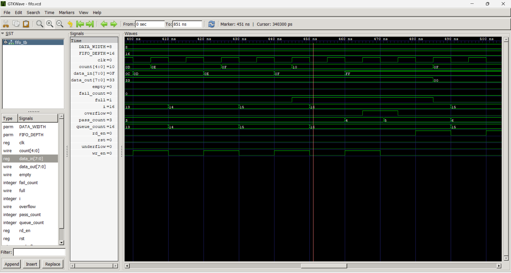
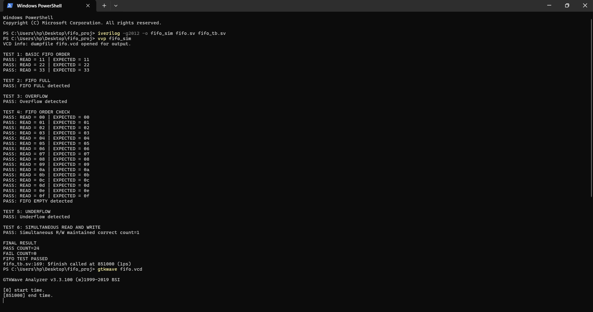

# Synchronous FIFO Design & Verification

A parameterizable Synchronous FIFO designed in SystemVerilog and verified using a custom testbench with GTKWave waveform analysis.

## Overview

This project demonstrates the digital design and functional verification of a Synchronous FIFO memory. The RTL includes write/read pointer logic, memory storage and full/empty status flag generation. Verification is performed using a SystemVerilog testbench and output waveforms are verified visually in GTKWave via VCD traces.

## Highlights

| Feature | Description |
| :--- | :--- |
| **Design Language** | SystemVerilog (`.sv`) |
| **Architecture** | Synchronous FIFO (Shared Clock) |
| **Status Flags** | Full (`full`), Empty (`empty`) |
| **Simulation Tool** | Icarus Verilog / ModelSim |
| **Waveform Viewer** | GTKWave (`.vcd` dump) |

## Project Structure

```text
fifo_proj/
├── fifo.sv                      # Synchronous FIFO core RTL module
├── fifo_tb.sv                   # Testbench for functional verification
├── fifo.vcd                     # Dumpfile containing simulation waveforms
├── fifo_sim                     # Compiled binary executable
├── flags_and_overflow.png       # Screenshot: Flags & boundary behavior
├── full_waveform_overview.png   # Screenshot: Complete GTKWave trace
├── simultaneous_rw.png          # Screenshot: Back-to-back Read/Write
└── terminal_pass_result.png     # Screenshot: Console simulation output

```

## RTL Design Features

The FIFO core module (`fifo.sv`) implements:

* **Memory Array:** Multi-word storage register file.
* **Pointer Logic:** Independent write (`wr_ptr`) and read (`rd_ptr`) address counters.
* **Status Flags:**
* **`empty`**: Asserted when no unread data exists.
* **`full`**: Asserted when memory capacity is reached.


* **Control Logic:** Prevents invalid writes when full and invalid reads when empty.

---

## Simulation Results & Verification Screenshots

### 1. Full Waveform Overview
Overall view of write operations followed by read operations, verifying overall FIFO functionality:


### 2. Simultaneous Read & Write
Verification of FIFO behavior during concurrent read and write operations:


### 3. Status Flags & Overflow Conditions
Demonstrating `full` and `empty` flag assertions along with overflow/underflow protection:


### 4. Terminal Pass Result
Simulation execution log confirming all testbench checks passed successfully:



